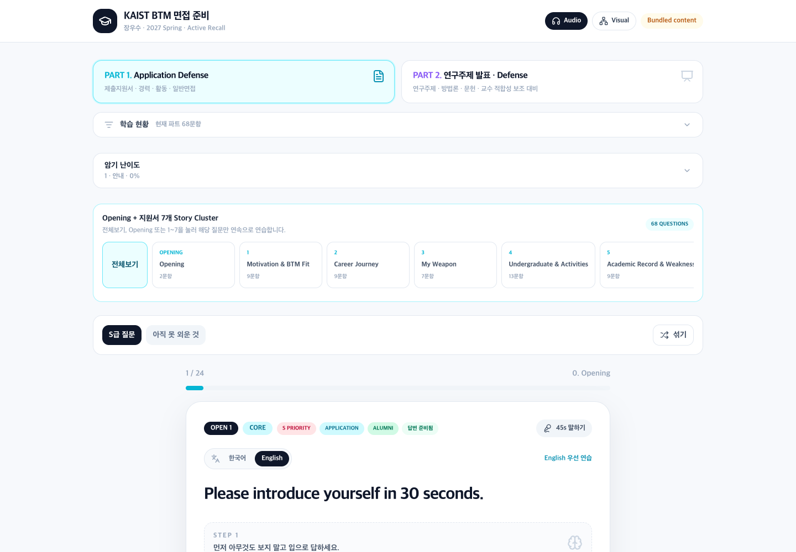
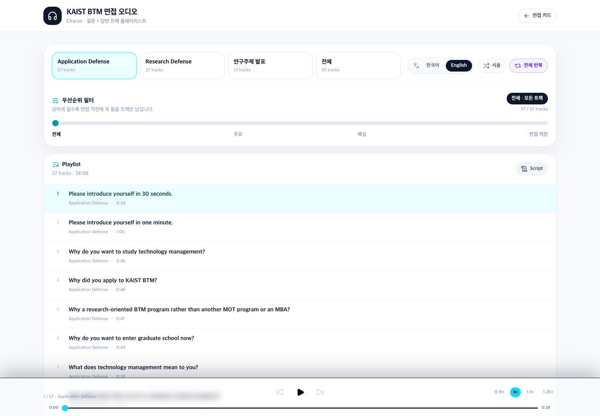
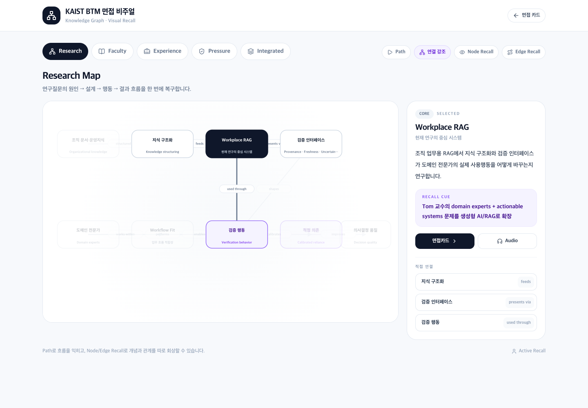
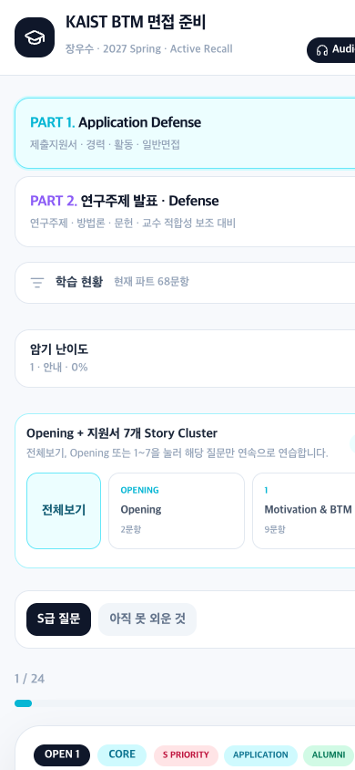

# KAIST BTM Interview Prep

**면접을 며칠 앞두고, 텍스트 위주의 준비 자료를 `말하고 · 듣고 · 보고 · 회상하는` 인터랙티브 학습 도구로 바꾼 개인 프로젝트입니다.**

**A personal project built just days before an actual graduate-school interview, turning text-heavy preparation into an interactive system for speaking, listening, visual recall, and active retrieval.**

### 🔗 Live

**https://kaist.oosu.dev**

> KAIST Business and Technology Management(BTM) 대학원 면접 준비를 위해 실제로 사용하고 있는 도구입니다. 범용 면접 서비스의 데모가 아니라, 제 지원서·경력·연구계획을 짧은 시간 안에 반복해서 꺼내 말할 수 있도록 설계했습니다.
>
> This is the tool I actually built and used to prepare for a KAIST BTM graduate-admissions interview. It is not a generic interview-app demo; it was designed around a concrete constraint: being able to retrieve my own application, career, and research story quickly under interview pressure.

---

## 왜 만들었나 / Why I built it

면접 준비 자료가 늘어날수록 Markdown 문서와 예상 질문을 계속 읽는 방식의 한계가 분명해졌습니다. **읽으면 익숙한데, 질문을 받으면 바로 말이 나오지 않는 문제**였습니다.

또 면접까지 시간이 많이 남지 않은 상황에서 모든 내용을 같은 강도로 반복하는 것도 비효율적이었습니다. 그래서 같은 정보를 여러 형태로 다시 접하면서도, 핵심은 항상 **답을 보기 전에 먼저 떠올리고 말하게 만드는 것**에 두었습니다.

- 면접카드에서는 답변을 단계적으로 가려 Active Recall을 연습합니다.
- Audio에서는 이동 중에도 질문 → 답변을 연속 재생하고, 우선순위 필터로 면접 직전 핵심 트랙만 남길 수 있습니다.
- Visual에서는 연구주제·경력·교수 적합성의 관계를 공간적으로 배치해 연결 구조를 기억합니다.
- 한국어와 영어를 같은 질문 구조에서 전환해, 영어 질문이 들어와도 별도의 암기 세트를 만들지 않도록 했습니다.

As the preparation material grew, repeatedly reading Markdown notes and model answers became less useful. The problem was simple: **the material felt familiar when I saw it, but I could not always retrieve it immediately when a question was asked.**

With only a few days left, rehearsing every question with equal intensity was also inefficient. I therefore designed the product around one principle: expose the same ideas through different media, but keep the learner in a **retrieve-first** loop rather than a reread-first loop.

- Interview cards progressively hide answer details to force active recall.
- Audio Recall supports continuous question → answer listening and a priority slider for last-minute review.
- Visual Recall maps relationships among experience, research design, and faculty fit spatially.
- Korean and English share the same underlying question structure, so English preparation does not become a separate memorization task.

---

## 제품 화면 / Product walkthrough

### 1. Application Defense — 지원서에서 바로 말하기

지원동기, 경력, 학점, 프로젝트, 활동을 하나의 긴 예상질문 목록으로 두지 않고 **Opening + Story Cluster**로 묶었습니다. 답변 공개 정도를 조절해 처음에는 충분한 힌트를 보고, 익숙해질수록 키워드만 남기는 방식으로 연습합니다.

Instead of treating dozens of application questions as one flat list, the app groups them into an **Opening + Story Cluster** structure. Progressive masking lets the same card move from guided rehearsal to near-blank recall.



### 2. Audio Recall — 모든 트랙을 듣는 대신, 지금 필요한 것만

질문과 답변을 미리 생성한 오디오 트랙으로 연결해 이동 중에도 연습할 수 있게 했습니다. 특히 트랙이 많아진 뒤에는 **우선순위 필터**를 추가했습니다.

`전체 → 주요 → 핵심 → 면접 직전`으로 슬라이더를 올릴수록 낮은 우선순위의 트랙이 사라집니다. 면접장으로 이동하는 순간에는 꼭 다시 들어야 하는 질문만 남길 수 있습니다.

Audio tracks combine each question and answer for continuous rehearsal. Once the playlist became large, I added a **priority filter** rather than another category menu.

Moving the slider from `All → Major → Core → Right before interview` progressively removes lower-priority tracks, making the same playlist useful both during broad preparation and in the final minutes before an interview.



### 3. Visual Recall — 문장이 아니라 관계를 기억하기

연구주제는 문장을 그대로 외우는 것보다 `문제 → 연구질문 → 문헌공백 → 방법론 → 기여`, 그리고 `경력 → 연구 관심 → 교수 적합성`의 연결을 기억하는 것이 더 중요하다고 판단했습니다.

그래서 노드와 관계를 직접 선택하고, Path / Node Recall / Edge Recall을 통해 **어떤 개념이 왜 연결되는지** 먼저 떠올리게 만들었습니다.

For research preparation, I found the relationships more important than memorizing exact sentences: `problem → research question → literature gap → method → contribution`, and `experience → research interest → faculty fit`.

The visual mode therefore turns those relationships into an interactive graph with Path, Node Recall, and Edge Recall modes.



### 4. Mobile-first rehearsal

실제로 가장 자주 연습하는 환경이 노트북 앞이 아니라 이동 중의 iPhone이었기 때문에, 면접카드·Audio·Visual 모두 작은 화면에서 바로 사용할 수 있도록 반복해서 모바일 UI를 다듬었습니다.

Because much of the actual rehearsal happens on an iPhone while moving rather than at a desk, the card, audio, and visual interfaces were repeatedly adjusted for small-screen use.

<p align="center">
  
</p>

---

## 단순한 예상질문 앱보다 중요했던 것 / Product decisions that mattered

### 1. 사실을 만들어내지 않기 / Fact integrity

면접 답변은 그럴듯한 문장보다 **사실관계가 맞는 것**이 더 중요했습니다. 그래서 지원서, 기존 기록, 직접 회상에서 확인된 내용과 아직 확인하지 못한 내용을 분리하고, 사실이 복원되지 않은 질문은 `partial / recover` 상태로 남기는 방식으로 작업했습니다.

For interview preparation, a polished but invented story is worse than an incomplete answer. The workflow therefore distinguishes verified application/history facts from unresolved details; questions stay partial until the underlying fact is recovered.

### 2. 암기량을 늘리지 않고 압축하기 / Compression over accumulation

질문 수가 늘어날 때마다 새로운 스크립트를 외우는 대신, 같은 경험을 여러 질문에서 재사용할 수 있도록 Story Cluster와 공통 cue를 만들었습니다. Audio의 우선순위 필터도 같은 원칙에서 나왔습니다.

Instead of memorizing a new script for every new question, the system reuses a smaller set of stories and cues across multiple prompts. The audio priority filter follows the same principle: reduce what must be actively rehearsed as the interview approaches.

### 3. 표기와 발음을 분리하기 / Separate written labels from TTS pronunciation

`KAIST BTM`, 사람 이름, 브랜드명처럼 TTS가 자주 틀리는 표현은 화면 표기와 음성 입력을 분리했습니다. 사용자가 보는 텍스트는 원래 표기를 유지하고, 오디오 생성 단계에서만 별도의 발음 사전을 적용합니다.

Terms such as `KAIST BTM`, personal names, and brand names are stored separately from their TTS pronunciation. The UI keeps the intended written form while the audio-generation pipeline applies a pronunciation dictionary only at synthesis time.

### 4. 공개 가능한 형태로 분리하기 / Privacy-aware public release

실제 프로젝트는 개인 지원서, 추천서, 기기 기록 등을 참고해 만들어졌지만 이 공개 저장소에는 원본 개인 문서를 포함하지 않습니다. 웹사이트에 표시하는 데 필요한 **sanitized content snapshot**과 실행 자산만 별도로 묶었습니다.

The private working project used application documents, recommendation material, and personal records as evidence. Those raw sources are deliberately excluded from this public repository; only a **sanitized content snapshot** and the assets required to run the product are bundled here.

---

## 구현 / Implementation

### Stack

- **Next.js 16** App Router
- **React 19 + TypeScript**
- **Tailwind CSS**
- Pre-generated MP3 assets for continuous audio practice
- Sanitized bundled interview-content snapshot for self-contained deployment

### Main product surfaces

| Surface | What it does |
| --- | --- |
| `Application Defense` | Opening, motivation, career, GPA, activities, project and personal-fit recall |
| `Research Defense` | Research question, literature gap, methodology, contribution, feasibility and faculty-fit defense |
| `Audio Recall` | Continuous KR/EN Q&A playback, shuffle/repeat and priority-based track reduction |
| `Visual Recall` | Spatial knowledge graph, Path Mode, Node Recall and Edge Recall |
| `Difficulty masking` | Progressively removes visible answer information as recall improves |

### Data layout

- `data/interview/content.json` — sanitized snapshot of content rendered by the app
- `public/audio/interview/` — per-card question/answer audio assets
- `public/audio/tracks/` — continuous-playback tracks and manifest
- `docs/screenshots/` — portfolio screenshots used in this README

The bundled snapshot is the production default, so a fresh clone does not depend on my private local folders. For private development only, `INTERVIEW_CONTENT_DIR` can override the bundled source.

---

## AI를 어떻게 사용했나 / How AI was used

이 프로젝트는 짧은 시간 안에 실제 문제를 해결하기 위해 **AI-assisted development**를 적극적으로 사용했습니다. 하지만 제품 방향, 어떤 정보를 복원해야 하는지, 무엇을 외우지 않아야 하는지, 우선순위를 어떻게 줄일지, 모바일에서 어떤 UI가 불편한지 같은 판단은 실제 면접 준비 과정에서 계속 수정했습니다.

저에게 이 프로젝트의 포인트는 “AI로 코드를 만들었다”가 아니라, **개인적인 문제를 제품 요구사항으로 바꾸고 → 빠르게 구현하고 → 실제 사용하면서 불편을 발견하고 → 다시 설계한 과정**에 있습니다.

I used **AI-assisted development** aggressively because the project had a real deadline. But the product direction came from actual use: deciding which facts needed recovery, which answers should not be invented, how aggressively to reduce rehearsal scope, where TTS pronunciation failed, and what broke on an iPhone.

For me, the portfolio value is not simply that AI helped generate code. It is the loop of **turning a personal constraint into product requirements → shipping quickly → using the product myself → observing friction → redesigning it.**

---

## Run locally

Node.js 20 or newer is recommended.

```bash
npm ci
npm run dev
```

Open `http://localhost:3000`.

Production build:

```bash
npm ci
npm run lint
npm run build
npm start
```

Set `PORT` to choose a production port, for example `PORT=3010 npm start`.

---

## Privacy

Original application PDFs, recommendation letters, device histories, personal logs, credentials, and private source documents are deliberately excluded. This repository contains only the sanitized interview-preparation content exposed by the application and the assets needed to run it.

## License

[MIT](LICENSE)
